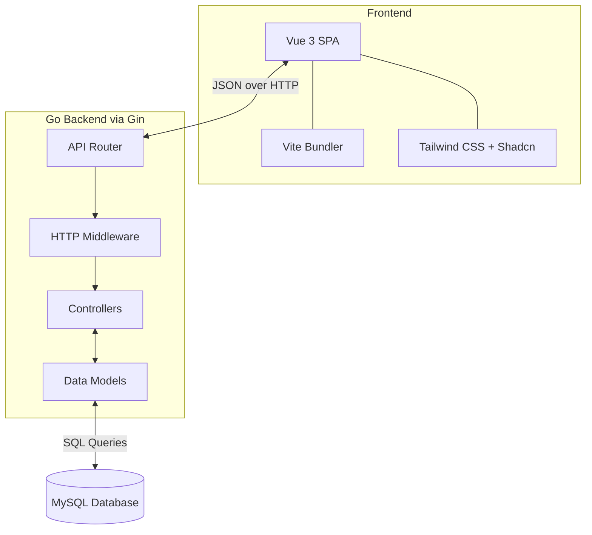

# Vuelang Framework

**Author**: Milan Madusanka, Associate TechOps Engineer

Vuelang is an enterprise-grade, full-stack MVC web framework. It bridges the performance of a Go backend with the reactivity of a Vue 3 frontend. Inspired by proven MVC architectural patterns, Vuelang provides a highly structured, scalable environment for rapid application development while maintaining the efficiency and low footprint characteristic of Go applications.

## System Architecture

Vuelang separates concerns into distinct layers, ensuring that business logic, routing, and data access remain decoupled. The Vue 3 frontend operates as a Single Page Application (SPA) communicating asynchronously with the Go API.



## Core Features

- **MVC Architecture**: Codebase is logically divided into `app/controllers`, `app/models`, and `app/middleware`.
- **Centralized Routing**: API endpoints are registered in a single `routes/api.go` file for maximum visibility and ease of management.
- **Embedded Production Builds**: The frontend compilation is embedded directly into the Go binary. A single executable runs the entire stack.
- **Hot-Reloading**: Utilizes `Air` for the Go backend and `Vite HMR` for the frontend, running concurrently during development.
- **Modern UI Stack**: The frontend is pre-configured with Vue 3, Tailwind CSS, and Shadcn Vue components.

## Directory Structure

```text
vuelang/
├── app/                  
│   ├── controllers/      # Route handlers implementing business logic
│   ├── middleware/       # HTTP request interceptors (e.g., authentication)
│   └── models/           # Database entities and data access layer
├── database/             # Schema definitions and migration scripts
├── internal/             # Core system initialization (config, database, server)
├── routes/               # API endpoint registries
├── ui/                   # Vue 3 frontend source code
├── main.go               # Application entry point
├── Makefile              # Automation commands
└── .env.example          # Environment variable template
```

## Setup and Installation

### System Requirements

- Go (v1.25.0 or higher)
- Node.js and npm
- MySQL Database

### Installation Instructions

1. **Clone the Repository**
   Navigate to your desired workspace and clone the repository.
   ```bash
   git clone https://github.com/milanz247/vuelang.git
   cd vuelang
   ```

2. **Environment Configuration**
   Duplicate the environment template and configure your database credentials.
   ```bash
   cp .env.example .env
   ```

3. **Install Dependencies**
   The provided Makefile automates the installation of Go modules, Node dependencies, and development tools.
   ```bash
   make install
   ```

## Development Workflow

To start the local development environment with concurrent hot-reloading for both the frontend and backend:

```bash
make dev
```

- The Go API will be available at `http://localhost:8080`.
- The Vue UI is proxied to Vite and accessible via `http://localhost:8080`.

## Production Deployment

To compile the application for a production environment:

```bash
make build
```

This command builds the optimized Vue frontend, injects it into the Go application, and compiles a single binary output located at `dist/vuelang`.

To run the production binary:

```bash
make run
```

## Adding New Resources

The MVC pattern makes adding new endpoints highly predictable:

1. Create a data model in `app/models/`.
2. Implement the business logic in `app/controllers/`.
3. Map the HTTP routes to the controller in `routes/api.go`.
